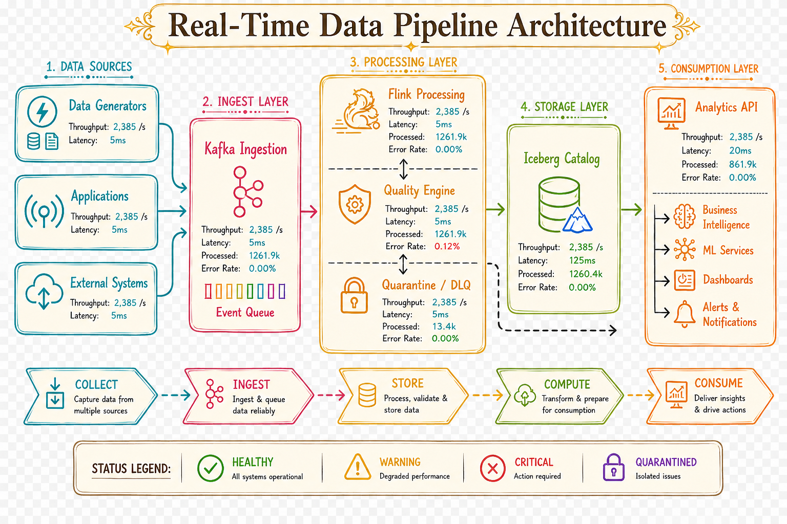
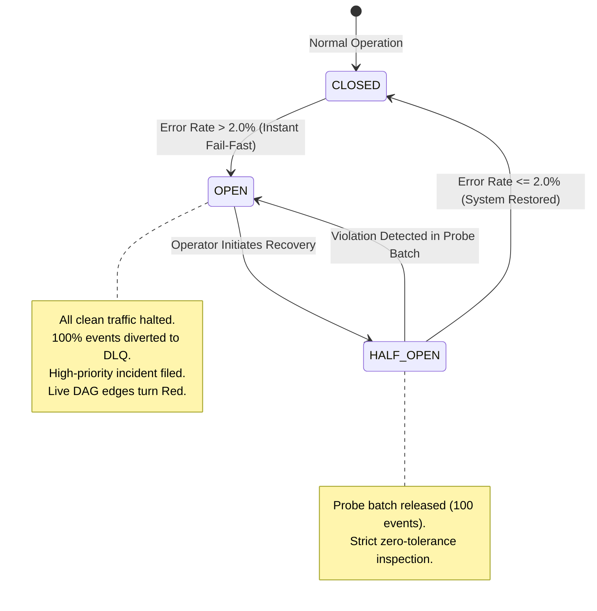

<div align="center">

# ⚡ ICE STREAM
### Real-Time Streaming Data Quality & Lakehouse Observability Platform

[](https://www.python.org/)
[](https://flink.apache.org/)
[](https://iceberg.apache.org/)
[](https://fastapi.tiangolo.com/)
[](https://react.dev/)
[](https://tailwindcss.com/)
[](https://vitejs.dev/)
[]()
[](https://opensource.org/licenses/MIT)

<br/>

<p align="center">
  <b>Enterprise-grade, zero-cloud-cost streaming data platform.</b><br/>
  Featuring real-time Kafka ingestion, Apache Flink tumbling window aggregations, sub-second schema validation against 8 canonical data-quality rules, an automatic 2% threshold Circuit Breaker, Apache Iceberg ACID Lakehouse storage on Backblaze B2, and a high-fidelity React Flow observability console.
</p>

[🚀 Quickstart](#-quickstart--setup) • [🏛️ Architecture](#-system-architecture) • [🛡️ Quality Rules](#-8-canonical-data-quality-rules) • [🚨 Circuit Breaker](#-circuit-breaker-engine) • [🌐 Dual-Host Deployment](#-dual-host-deployment-guide) • [📖 Documentation](#-documentation-index)

<br/>

---

### 🏛️ Architecture Blueprint


---

</div>

<br/>

## 🌟 Executive Summary & Highlights

| Capability | Implementation | Technology | SLA / Metric |
| :--- | :--- | :--- | :--- |
| **Streaming Ingestion** | SASL_SSL TLS encrypted transactional producer & consumer | **Aiven Cloud Kafka** | `p99 < 15ms` latency |
| **Stream Processing** | 10-second tumbling windows, watermarking, out-of-order handling | **Apache Flink 1.18.1** | Native streaming state |
| **Data Quality Gate** | Sub-second schema & semantic validation across 8 canonical rules | **ValidationEngine** | 100% deterministic |
| **Reliability Gate** | Automated isolation when error rate exceeds 2.0% | **Circuit Breaker** | `0ms` manual downtime |
| **ACID Lakehouse** | S3FileIO with SQLite JdbcCatalog, partition pruning & time-travel | **Apache Iceberg 1.5.2** | Zero compute storage cost |
| **Observability Gateway** | Real-time REST endpoints, incident ledger, and WebSocket push | **FastAPI + Uvicorn** | Sub-millisecond queries |
| **Interactive Console** | Balanced 2D topological DAG with node inspection drawers | **React 19 + React Flow** | Live telemetry streaming |
| **Incident Escalation** | Dual-channel encrypted Gmail SMTP notification dispatch | **Google App Auth** | Concurrent lead notification |

<br/>

---

## 🏛️ System Flow & Topology

```
                          ┌──────────────────────────┐
                          │  Python Event Producer   │
                          │  (Transaction Generator) │
                          └─────────────┬────────────┘
                                        │ (SASL_SSL / TLS)
                                        ▼
                          ┌──────────────────────────┐
                          │    Aiven Cloud Kafka     │
                          │   (events-topic queue)   │
                          └─────────────┬────────────┘
                                        │
                                        ▼
                          ┌──────────────────────────┐
                          │   Apache Flink 1.18.1    │
                          │  (10s Tumbling Windows)  │
                          └─────────────┬────────────┘
                                        │
                                        ▼
                          ┌──────────────────────────┐
                          │     ValidationEngine     │
                          │   (Rules DQ-001..008)    │
                          └─────────────┬────────────┘
                                        │
                                        ▼
                          ┌──────────────────────────┐
                          │  Circuit Breaker Gate    │
                          │   (Strict 2% Threshold)  │
                          └──────┬────────────┬──────┘
                  Valid (≤ 2%)   │            │   Tripped (> 2%)
                  CLOSED Path    │            │   OPEN Path (DLQ)
                                 ▼            ▼
                   ┌─────────────────┐    ┌─────────────────┐
                   │  clean_events   │    │   dlq_events    │
                   │ (Active Stream) │    │  (Quarantined)  │
                   └────────┬────────┘    └────────┬────────┘
                            │                      │
                            ▼                      ▼
                 ┌────────────────────────────────────────────┐
                 │     Apache Iceberg 1.5.2 Lakehouse         │
                 │     - Backblaze B2 Object Storage (S3)     │
                 │     - SQLite JdbcCatalog (ACID Metadata)   │
                 └──────────────────────┬─────────────────────┘
                                        │
                                        ▼
                 ┌────────────────────────────────────────────┐
                 │     FastAPI Observability Gateway          │
                 │     - REST API (/api/...)                  │
                 │     - WebSocket Telemetry Push (/ws)       │
                 │     - Incident Ledger & Recovery Audits    │
                 └──────────────────────┬─────────────────────┘
                                        │
                                        ▼
                 ┌────────────────────────────────────────────┐
                 │     React 19 + React Flow Console          │
                 │     - 4-Column Live Topological DAG        │
                 │     - Dynamic Edge State Reactivity        │
                 │     - Slide-Over Node Telemetry Drawer     │
                 └────────────────────────────────────────────┘
```

<br/>

---

## 🛡️ 8 Canonical Data Quality Rules

Every transaction streaming through the pipeline is evaluated across eight strict validation rules before landing in the lakehouse:

| Rule Code | Violation Name | Severity | Definition & Validation Check | Action Taken |
| :--- | :--- | :---: | :--- | :--- |
| **`DQ-001`** | `REQUIRED_FIELD_MISSING` |  | Essential transaction fields (`event_id`, `timestamp`, `user_id`, `amount`) are absent | Quarantined to DLQ |
| **`DQ-002`** | `NULL_REQUIRED_FIELD` |  | Mandatory fields contain explicit `null` or empty whitespace values | Quarantined to DLQ |
| **`DQ-003`** | `INVALID_TYPE` |  | Value fails strict type coercion (e.g., string passed in numerical `amount`) | Quarantined to DLQ |
| **`DQ-004`** | `INVALID_RANGE` |  | Transaction values violate logical bounds (`amount <= 0` or `amount > 500,000`) | Quarantined to DLQ |
| **`DQ-005`** | `INVALID_ENUM` |  | Categorical values not recognized in canonical enum lists (`payment_method`, `currency`) | Quarantined to DLQ |
| **`DQ-006`** | `DUPLICATE_EVENT` |  | Duplicate `event_id` encountered within bounded 10-minute watermark window | Logged & Deduplicated |
| **`DQ-007`** | `SCHEMA_MISMATCH` |  | Record schema violates declared payload contract specification | Quarantined to DLQ |
| **`DQ-008`** | `UNKNOWN_SCHEMA_VERSION` |  | Unrecognized or unsupported schema version header detected | Quarantined to DLQ |

<br/>

---

## 🚨 Circuit Breaker Engine

Ice Stream implements a production-grade automated Circuit Breaker that evaluates streaming error rates in real time:

$$\text{Error Rate} = \frac{\text{Invalid Events (DQ-001..008)}}{\text{Total Window Events}}$$



- 🟢 **`CLOSED` (Normal)**: Valid records stream to `clean_events` Iceberg table; invalid records divert to DLQ.
- 🔴 **`OPEN` (Tripped)**: Window error rate breaches `0.02` ($>2\%$). The pipeline immediately isolates the clean lakehouse, routing 100% of events to quarantine.
- 🟡 **`HALF_OPEN` (Probe Mode)**: Operator invokes recovery via `POST /api/recovery`. A controlled probe batch verifies schema stability before restoring the clean path.

<br/>

---

## 🌐 Dual-Host Deployment Guide

Ice Stream is structured so that the **Frontend** and **Backend** can be hosted independently on separate websites/cloud servers with zero configuration friction.

<div align="center">

[](docs/deployment_guide.md)
[](docs/deployment_guide.md)
[](docs/deployment_guide.md)
[](docs/deployment_guide.md)

</div>

### 1. Frontend Setup (Vercel / Netlify)
1. Import repository and set **Root Directory** to `frontend`.
2. Configure Environment Variable:
   ```env
   VITE_API_URL=https://your-backend-service.onrender.com
   ```
3. *Single Page Application (SPA) rewrites (`/console/*`) are automatically handled by the included `frontend/vercel.json` and `frontend/public/_redirects`.*

### 2. Backend Setup (Render / Railway / Fly.io)
1. Create a Python Web Service with root directory `.`.
2. Build command: `pip install -r requirements.txt`
3. Start command: `uvicorn app.api.main:app --host 0.0.0.0 --port $PORT` *(or use included `Procfile`)*.
4. Set `ALLOWED_ORIGINS` to your deployed frontend domain:
   ```env
   ALLOWED_ORIGINS=https://your-frontend.vercel.app
   ```

> 📖 **Full Step-by-Step Instructions**: Read the complete [Dual-Host Deployment Guide](docs/deployment_guide.md).

<br/>

---

## 🚀 Quickstart & Setup

### Prerequisites
- **Python**: 3.11 or higher
- **Node.js**: v18 or higher (with npm)
- **Java**: JRE 11+ *(required for Apache Flink engine)*

### 1. Clone & Setup Secrets
```bash
git clone https://github.com/sanika-mankar/Ice-stream-lakehouse-observability.git
cd Ice-stream-lakehouse-observability
cp .env.example .env
```
*Fill in your Kafka and Backblaze B2 keys in `.env` (never committed to git).*

### 2. Launch FastAPI Backend
```powershell
# Create and activate virtual environment
python -m venv venv
.\venv\Scripts\Activate.ps1

# Install production dependencies
pip install -r requirements.txt

# Start backend server
uvicorn app.api.main:app --host 127.0.0.1 --port 8000 --reload
```
*Interactive Swagger Documentation available at `http://127.0.0.1:8000/docs`.*

### 3. Launch React Console
```powershell
cd frontend
npm install
npm run dev
```
*Open `http://localhost:5173/console/overview` to enter the Command Center.*

<br/>

---

## 🧪 Verification & Automated Testing

```powershell
# Run the complete automated unit test suite (57 tests)
pytest tests/unit/ -v

# Run live Circuit Breaker and streaming validation
python scripts/test_master_6_circuit_scenarios.py

# Verify frontend TypeScript checks and production bundling
cd frontend
npm run build
```

<br/>

---

## 📁 Repository Structure

```text
├── app/                        # FastAPI Backend & Streaming Services
│   ├── api/                    # REST Endpoints (/health, /metrics, /pipeline, /contact)
│   │   ├── routes/             # Modular routers (quarantine, simulation, lakehouse)
│   │   └── websockets.py       # Live WebSocket broadcaster engine (/ws)
│   ├── ingestion/              # Kafka event generator & transactional producer
│   ├── observability/          # Circuit breaker state machine & incident repository
│   ├── storage/                # Apache Iceberg catalog & Backblaze B2 S3FileIO
│   └── validation/             # Canonical DQ-001..DQ-008 schema validation engine
├── frontend/                   # React 19 + TypeScript + Tailwind CSS Console
│   ├── src/                    # Components, pages, and Zustand real-time stores
│   │   ├── components/pipeline # Redesigned 2D CustomNode, CustomEdge & SidePanel
│   │   └── pages/              # Overview, Pipeline, Data Quality, Reliability, Lakehouse
│   ├── vercel.json             # Vercel SPA client-side rewrite rules
│   └── public/_redirects       # Netlify / Cloudflare SPA routing rules
├── docs/                       # Architectural Specifications & Runbooks
│   ├── deployment_guide.md     # Dual-host deployment manual
│   ├── architecture.md         # Deep-dive design specifications
│   ├── operations.md           # Operational incident response guide
│   └── data-contract.md        # JSON schema payload data contract
├── flink/                      # Apache Flink 1.18.1 Streaming Jobs & Docker setup
├── scripts/                    # Operational verification, smoke tests & sanity checks
├── tests/                      # Pytest unit and integration test suites
├── Procfile                    # Cloud platform deployment entrypoint
└── requirements.txt            # Production backend Python dependencies
```

<br/>

---

## 📖 Documentation Index

- 📘 [Dual-Host Deployment Guide](docs/deployment_guide.md) — Comprehensive guide for Vercel + Render hosting.
- 📗 [Frontend Quickstart](docs/frontend-quickstart.md) — UI setup and developer guide.
- 📙 [Architecture & System Design](docs/architecture.md) — Complete technical specification.
- 📕 [Operational Runbook](docs/operations.md) — Production operations & playbook.
- 📓 [Failure Modes & Recovery](docs/failure-recovery.md) — Fault tolerance & self-healing workflows.
- 📒 [Data Contract Specification](docs/data-contract.md) — Canonical schema and DQ rules.

<br/>

---

## 👥 Engineering Team

<div align="center">

| **Sanika Mankar** | **Santosh Kumar** |
| :---: | :---: |
| Lead Data & Observability Engineer | Lead Full-Stack & Infrastructure Engineer |
| [@sanika-mankar](https://github.com/sanika-mankar) | [@Sant7124](https://github.com/Sant7124) |

</div>

<br/>

---

<div align="center">
  <sub>Built with precision for enterprise streaming observability. Released under the <a href="LICENSE">MIT License</a>.</sub>
</div>
